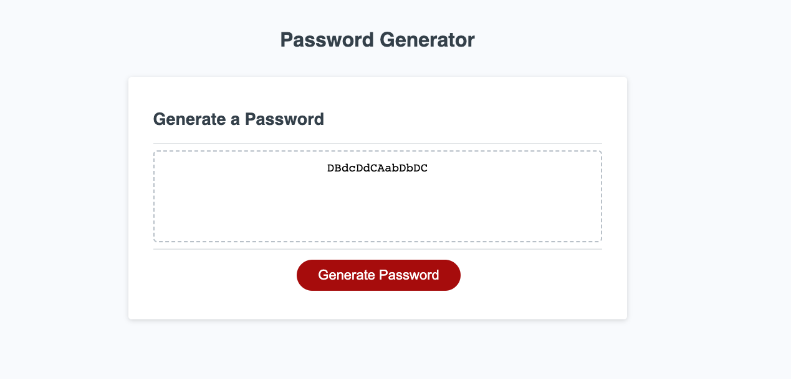

# Password-Generator

## Description

The employee the password generator was created for needed a program that could randomly generate strong passwords so the senstivie data they have access to is secure. 🔐  

The features of this password generator include:
 
✅ Employee can set the length of the password anyhwere from 8 to 128 characters by way of input.  

✅ Employee can choose whether to include **special characters** in the password by way of confirmation. #️⃣ 

✅ Employee can choose whether to include **numeric characters** in the password by way of confirmation. 🔢

✅ Employee can choose whether to include **lowercase characters** in the password by way of confirmation. 🔡

✅ Employee can choose whether to include **uppercase characters** in the password by way of confirmation. 🔠

❗️The employee must select one of these types of characters for the password to be generated. 

The function used to generate the random password is invoked when the employee clicks the red **Generate Password** button. 🔴
_______________________________________________________________________

## Access 

To access the random password generator, simply click on the GitHub Pages link in the repo description or follow the link below. 🔗
[Random Password Generator](lillianedwards.github.io/Password-Generator)

## Installation 

For users new to GitHub, follow the git clone process to copy the code into your local respository. 

## Usage 

## Credit

I worked on this project alone, but recived help from my tutor, Andres Jimenez, and my course instructor, Ben Machock.

## License
This project is not licensed.
